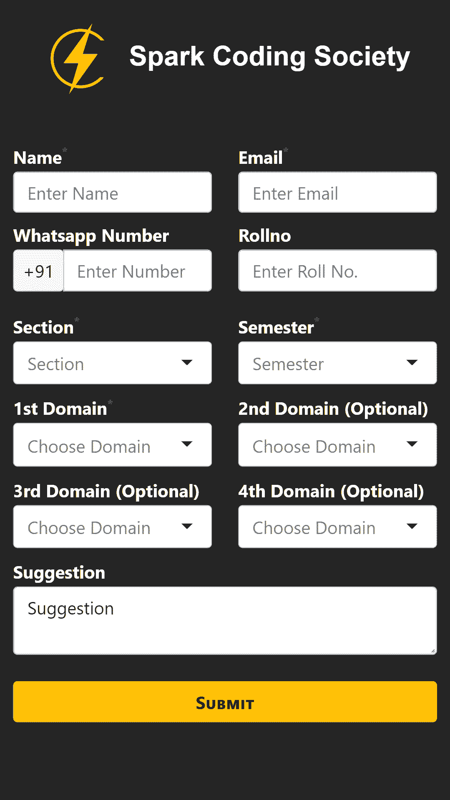
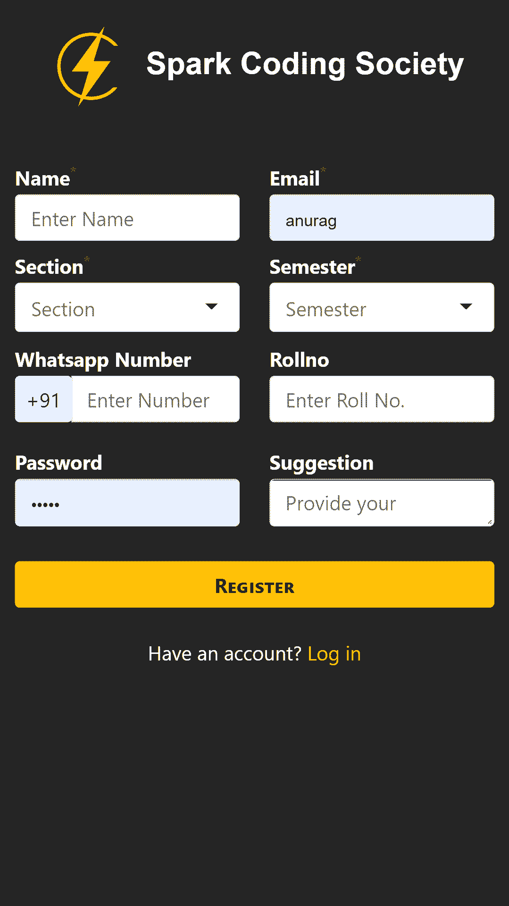
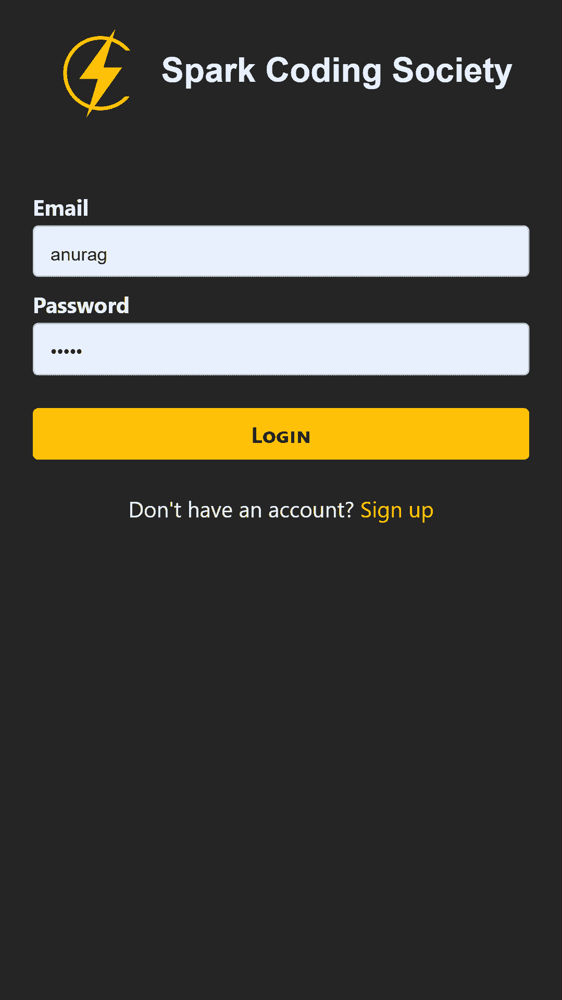
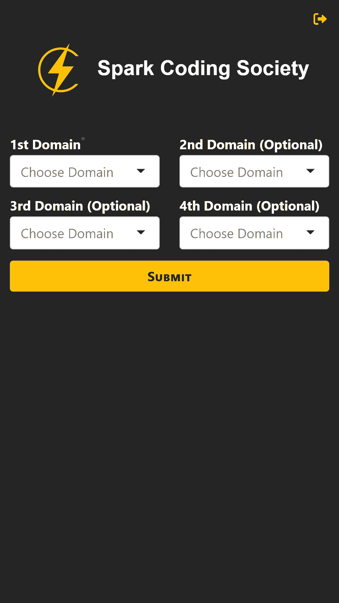
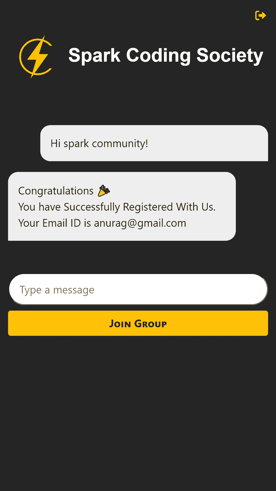

# UI 
## Register in one

## Student Registeration page

## Login page

## Add Domain page

## Welcome page

# Top priority categories
SELECT cid,SUM(priority) AS pr FROM `spark_priorities` GROUP by cid ORDER BY pr DESC;

# Top priority categories with name
SELECT cat.category as category_name, SUM(prior.priority) AS pr FROM `spark_priorities` AS prior JOIN spark_categories as cat ON prior.cid = cat.id GROUP by cid ORDER BY pr DESC

# students Data with priority of domains
SELECT stu.id, name,email, GROUP_CONCAT(category) as priority FROM `spark_students` AS stu JOIN spark_priorities AS prior ON stu.id = prior.sid JOIN spark_categories AS cat ON prior.cid = cat.id GROUP BY id";

# First priority categories
SELECT *, SUM(priority) FROM `spark_priorities` WHERE priority = -1 GROUP by cid;
## Updated
SELECT cat.category as category_name ,SUM(prior.priority) as totalpr FROM `spark_priorities` AS prior JOIN spark_categories AS cat ON prior.cid = cat.id WHERE prior.priority = '$filter' GROUP BY cid ORDER BY totalpr

# second priority categories
SELECT *, SUM(priority) FROM `spark_priorities` WHERE priority = -2 GROUP by cid;
# Third priority categories
SELECT *, SUM(priority) FROM `spark_priorities` WHERE priority = -3 GROUP by cid;